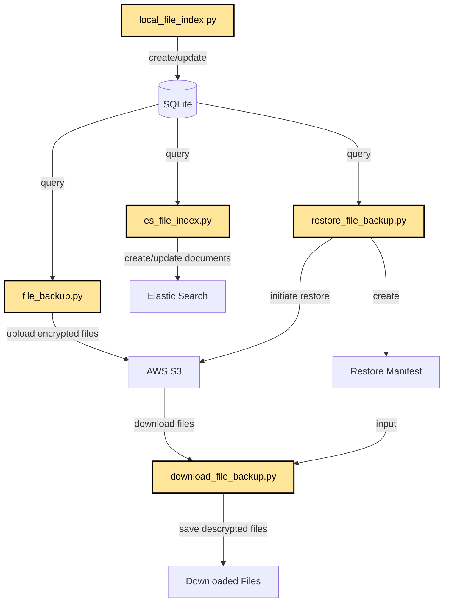
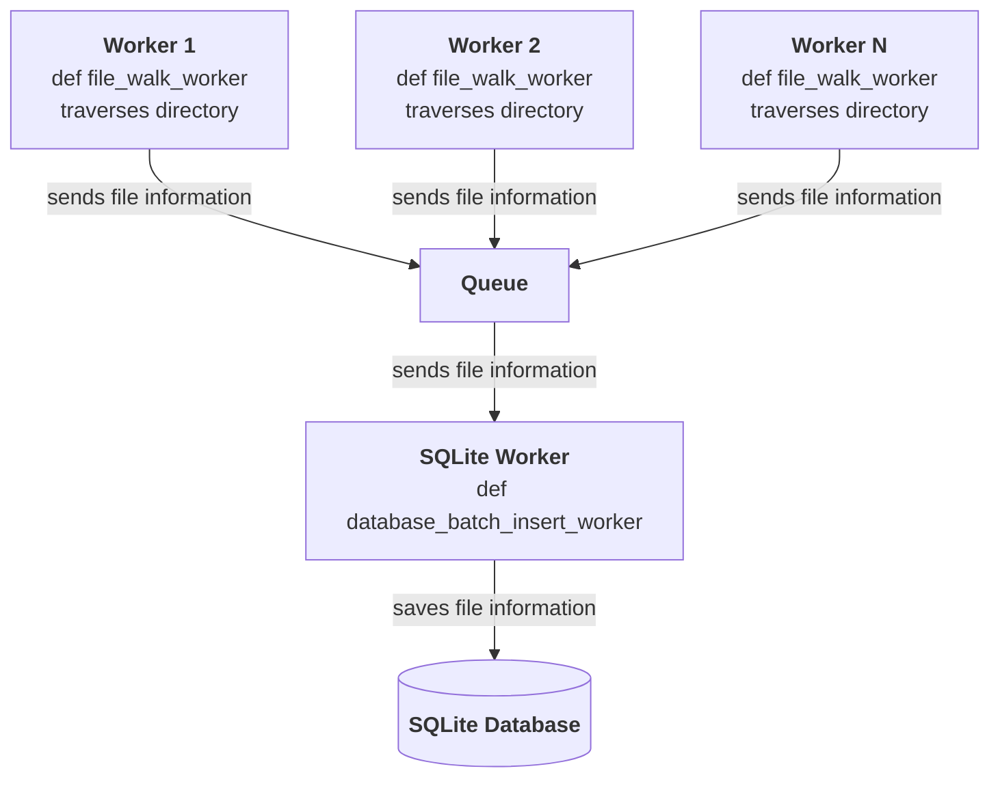
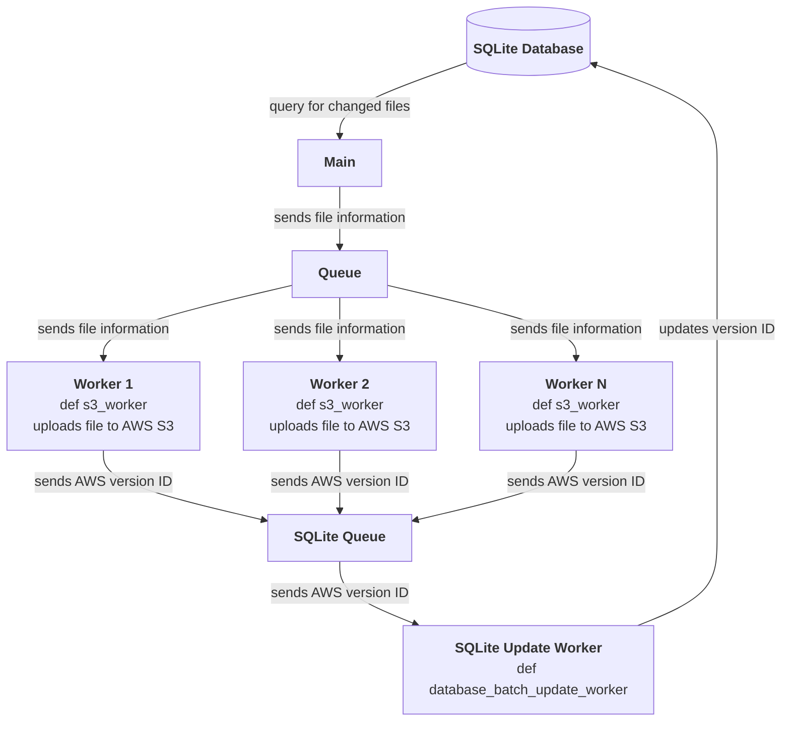

# File Management Scripts

General structure of scripts



# Scripts

## local_file_index

The `local_file_index.py` script walks the directories found in the configuration file field, `INDEX_PATHS`. The script indexes the files found in those directories into an SQLite database. If the filepath exists in the database under the column `path`, a new item is created with the same `path` and an incremented `version`. Items are not deleted from the database.

Scripts arguments

| Argument   | Required | Default       | Type | Description                                         |
|------------|----------|---------------|------|-----------------------------------------------------|
| --config   | No       | config.ini    | str  | Path to the configuration file (ini format)         |

General structure of `local_file_index.py`



### SQLite database schema

| Column           | Type            | Constraints         | Description             |
| ---------------- | --------------- | ------------------- | ----------------------- |
| path             | TEXT            | NOT NULL            | File path               |
| version          | INTEGER         | NOT NULL, DEFAULT 1 | Version number          |
| aws_version      | TEXT            |                     | AWS version (optional)  |
| size             | INTEGER         | NOT NULL            | File size               |
| last_modified_at | INTEGER         | NOT NULL            | Last modified timestamp |
| PRIMARY KEY      | (path, version) |                     | Composite primary key   |

## file_backup

The `file_backup` script queries the SQLite database for files with a `last_modified_at` greater than the `last_backup_time`. The files from the SQLite Database are then uploaded to the AWS S3 bucket with a Storage Type of `DEEP_ARCHIVE`. The AWS Version ID is returned and stored in the SQLite database.

Notes

- The `last_backup_time` is found in the `last_backup_time.txt` file in the AWS S3 bucket.
- The `last_backup_time` is updated after the files are uploaded to AWS S3

Scripts arguments

| Argument   | Required | Default       | Type | Description                                         |
|------------|----------|---------------|------|-----------------------------------------------------|
| --config   | No       | config.ini    | str  | Path to the configuration file (ini format)         |

General structure of `file_backup.py`



## es_file_index

The `es_file_index` script queries the Neo4J database for Published (primary and processed datasets) and QA datasets. The files for each dataset are retrieved from the SQLite database. File information is then generated and indexed into Elastic Search. Published datasets are indexed into the public and consortium indices and QA datasets are indexed into the consortium index.

Scripts arguments

| Argument   | Required | Default       | Type | Description                                         |
|------------|----------|---------------|------|-----------------------------------------------------|
| --config   | No       | config.ini    | str  | Path to the configuration file (ini format)         |

## restore_file_backup

The `restore_file_backup` scripts are used to restore files and directories from AWS S3. The files need to be restored from `DEEP_ARCHIVE` and then downloaded. The restore process can take 24 hours.

### restore_file_backup.py

The `restore_file_backup.py` script is used to restore files and directories in AWS S3. Files are only restored for 1 day and use the bulk restore tier. These options limit costs.

Scripts arguments

| Argument       | Required | Default    | Type | Description                                                       |
| -------------- | -------- | ---------- | ---- | ----------------------------------------------------------------- |
| --config       | No       | config.ini | str  | Path to the configuration file (ini format)                       |
| --path         | Yes      | None       | str  | Path prefix to restore files from (e.g., 'path/to/files')         |
| --time         | Yes      | None       | int  | Time to restore files to (in seconds since epoch, unix timestamp) |
| --version      | No       | latest     | str  | Version of files to restore (latest, earliest, or all)            |
| --recursive    | No       | False      | flag | Restore files and directories recursively                         |
| --manifestonly | No       | False      | flag | Only generate the restore manifest file                           |

### download_file_backup.py

The `download_file_backup.py` script is used to download restored files from AWS S3.

Scripts arguments

| Argument   | Required | Default | Type | Description                                 |
| ---------- | -------- | ------- | ---- | ------------------------------------------- |
| --config   | Yes      | None    | str  | Path to the configuration file (ini format) |
| --manifest | Yes      | None    | str  | Path to the restore manifest file           |
| --out      | Yes      | "/"     | str  | Directory to download files to              |

# Running scripts

## Configuration file

A configuration file is required to run the scripts. An example configuration file can be found in `config.ini.example`.

## Dependencies

Dependencies are found in the `requirements.txt` file and can be installed with `pip install -r requirements.txt`.

## Running scripts

### local_file_index

```bash
    # config parameter defaults to 'config.ini'
    python local_file_index/local_file_index.py --config config.ini
```

### file_backup

```bash
    # config parameter defaults to 'config.ini'
    python file_backup/file_backup.py --config config.ini
```

### es_file_index

```bash
    # config parameter defaults to 'config.ini'
    python es_file_index/es_file_index.py --config config.ini
```
